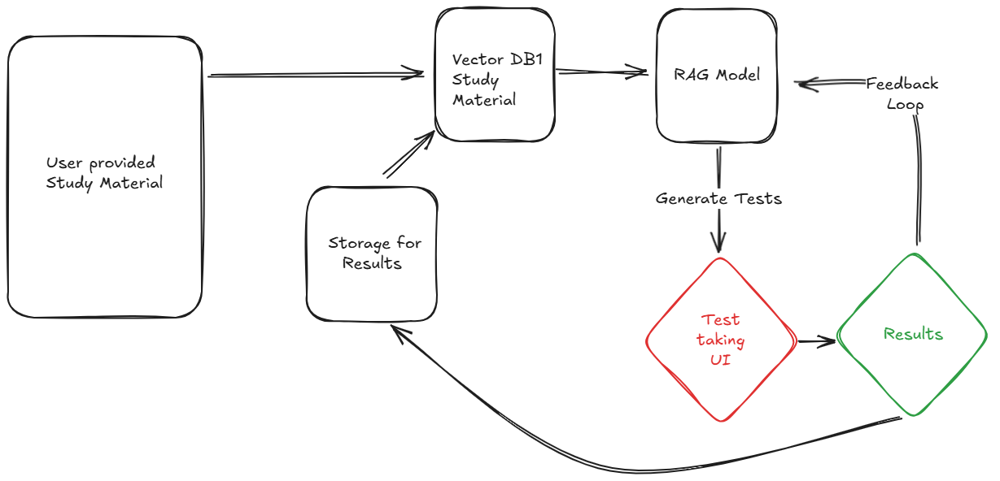

### Test Taking 
**Project Title**: **Adaptive Question Generation and Feedback System with RAG Model**

**Project Overview**:  
This project aims to create an intelligent system powered by a **Retrieval-Augmented Generation (RAG)** model to generate *N* questions of *K* difficulty levels from user-provided study materials. The system will dynamically generate questions focused on the user's weak areas, enabling targeted practice and improving overall performance over time. It will also feature robust tracking and analytics to monitor progress.

---

### **Key Features**:

1. **RAG-Powered Question Generation**:
   - Leverage a **RAG model** to retrieve relevant content from study materials and generate contextually accurate questions.
   - Tailor questions to specific difficulty levels (*K*) and user-defined parameters.
   - Support various question formats, including multiple-choice, fill-in-the-blank, and short-answer.

2. **Targeted Question Generation for Weak Areas**:
   - Analyze user responses to identify recurring weak points in knowledge or skills.
   - Generate focused practice questions specifically designed to address these weak areas.
   - Adapt difficulty levels over time as the user improves.

3. **Performance Tracking and Feedback**:
   - Visualize progress over time with detailed analytics and trends.
   - Provide actionable feedback on each attempt, highlighting strengths and areas for improvement.
   - Recommend additional resources or follow-up questions for persistent weak points.

4. **Customizable Parameters**:
   - Enable users to control the number of questions (*N*), difficulty levels (*K*), and focus areas.
   - Allow uploading of diverse study materials (PDFs, notes, web links) as input.

5. **Progressive Improvement**:
   - Continuously refine the question pool and feedback mechanisms using user data.
   - Provide periodic reports summarizing progress and milestones achieved.

---

### **Technology Stack**:

- **Retrieval Component**:
  - FAISS or ElasticSearch for semantic search.
  - Vector storage solutions like Pinecone for efficient retrieval of embeddings.

- **Generation Component**:
  - OpenAI GPT models, Hugging Face's Llama 2, or other advanced LLMs for question creation.
  - Fine-tuned models for domain-specific question generation if needed.

- **Backend**: FastAPI or Flask for integration of RAG pipelines, performance tracking, and feedback systems.

- **Frontend**: ReactJS or Vue.js for an interactive and user-friendly interface.

- **Data Storage**:
  - Cloud storage (e.g., AWS S3, Google Cloud Storage) for managing user-provided materials.
  - Databases (PostgreSQL, DynamoDB) for storing user performance data and question history.

- **Machine Learning**:
  - TensorFlow or PyTorch for building adaptive feedback and tracking mechanisms.

---

### **Key Benefits**:
- Focused learning through questions targeting weak areas.
- Dynamic and adaptive improvement mechanism ensures users achieve a balanced knowledge base.
- Scalable design to handle large datasets and multiple users simultaneously.

---

### **Use Cases**:
1. **Students**: Custom quizzes and targeted feedback for exam preparation.
2. **Educators**: Automated tools to assess and help students in real-time.
3. **Corporate Training**: Tailored assessments for employee skill development.

Let me know if there are any other refinements you'd like!

